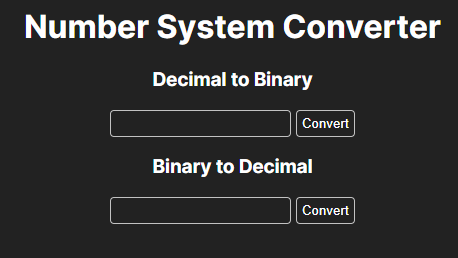
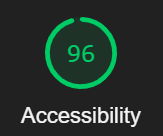

# SQA-Assignment-2---Number-System-Converter
Assignment work

## The Team
<table>
  <tbody align="center">
    <tr>
      <th>Name</th>
      <th>Role</th>
      <th>Responsibilities</th>
      <th>Github</th> 
    </tr>
    <tr>
      <td>Luke Jones</td>
      <td>JS Developer (Back end code), tester</td>
      <td>Writing, carrying out and documenting unit tests and processes, binary to decimal system conversion code</td>
        <td><a href="https://github.com/lukejs01"></img></a></td>
    </tr>
    <tr>
      <td>Cameron Yorke</td>
      <td>QA Tester</td>
      <td>Writing UI tests and test plan, documentation of processes, setup of CI/CD workflows</td>
      <td><a href="https://github.com/bluepicnic/"></img></a></td>
    </tr>
    <tr>
      <td>Jacob Bright</td>
      <td>Full stack developer</td>
      <td>Creation of front end scripts, project styling through CSS, code refactoring and accessibility improvements, decimal to binary system conversion</td>
      <td><a href="https://github.com/bongoSLAP"></img></a></td>
    </tr>
    
  </tbody>
</table>

## Using The Application 
To use the application we would highly recommend using this GitHub link: https://github.com/bluepicnic/SQA-Assignment-2---Number-System-Converter.git

It is possible to do this on your local machine either by cloning the repository and opening in an IDE. After that you would then run the command "npm start" in a suitable console with node.js installed to manually test the application or run "yarn test" to run the unit tests.

Another option is to use <a href="https://replit.com/">Replit</a> and create a Repl by copying the above link. This can be done from the Replit home page by:

<ol>
  <li>Clicking "Create" in the top left of the page</li>
     
  <li>Clicking "Import from GitHub" button at the top of revealed box</li>
      
  <li>Paste the GitHub URL in the respective field, and click the "Import from GitHub" button</li>
  </img>
</ol>

Once inside the Repl with the imported repository, the code from that point can be run using button on the replit interface. 

#### Rules of the Number System Converter
The developed Number System Converter can convert a decimal number to binary and vice-versa using the respective fields and buttons. 

The converter can only convert numbers with integer values, however, as floating point numbers in binary are infinitely recurring and would not work with both the interface and input. The converter itself will round numbers expressed as floating point numbers down to the number expressed on the left of any decimal point entered. 

From an ease of use perspective, all binary numbers expressed within the converter (both input and output) are unsigned. Binary numbers themeselves are also not capped at a certain number of bits or bytes, in order to maximise the amount of numbers that can be converted.  

## Testing 

### TDD
### Test Requirements
We adopted Test Driven Development (TDD) as our software development process in order to write quality tests for our code and emphasise our focus on requirements. This aliged with the processes we were following within our github repository, as we ensured we had a CI/CD workflow within github actions and a number of issues to track progress with. 

Tests were written prior to implementing any functionality in order to adhere to TDD at each stage of development. This benefitted us by altering our perspective as developers to focus on tests and interaction before functionality was included, which ensured quality by granting us goals and requirements to adhere to. 

We made use of TDD's principles of writing tests before code, and ensuring those tests pass by writing just the right amount of code to allow for future refactoring. This could be considered at odds with our coding standards, as TDD's reliance on refactoring means that temporary or "lower quality" code was pushed to our repository in order to ensure tests at all levels could be completed. However, we made sure to rectify these issues in the refactoring stages, by not only producing improved upon code that passed tests, but also adhered more rigorously to our standards. 

### UI Testing
Before developing the front end, we drafted various UI tests to potentially be used later in development. These tests were later refined into test scripts before implementing any javascript code related to functionality, and after HTML interface scripting had finished. These tests, and their results can be found below.

#### Manual UI Tests
<table>
  <tbody align="center">
    <tr>
      <th>No.</th>
      <th>Actions</th>
      <th>Steps</th>
      <th>Expected Outcome</th>
      <th>Actual Outcome</th>
      <th>Test result</th>
    </tr>
    <tr>
      <td>1.</td>
      <td>Number is captured through input</td>
      <td>
        <ol>
          <li>Clicks on the input field</li>
          <li>Enter number into field</li>
        </ol>
      </td>
      <td>The input field should contain the entered number</td>
      <td>Input field contains the entered number </td>
      <td>Pass</td>
    </tr>
    <tr>
      <td>2.</td>
      <td>"Convert to binary" button press converts decimal number in input field to binary</td>
      <td>
        <ol>
          <li>Click on the decimal input field, under the relevant heading</li>
          <li>Enter decimal number into field</li>
          <li>Click "convert to binary" button</li>
        </ol>
      </td>
      <td>Relevant output field should contain converted decimal number expressed as a binary number </td>
      <td>Output field contains converted decimal number in binary format</td>
      <td>Pass</td>
    </tr>
    <tr>
      <td>3.</td>
      <td>"Convert to decimal" button press converts binary number in input field to decimal</td>
      <td>
        <ol>
          <li>Click on the binary input field, under the relevant heading</li>
          <li>Enter binary number into field</li>
          <li>Click "convert to decimal" button</li>
        </ol>
      </td>
      <td>Relevant output field should contain converted binary number expressed as a decimal number </td>
      <td>Output field contains converted binary number in decimal format</td>
      <td>Pass</td>
    </tr>
    <tr>
     <td>4.</td>
      <td>Error message appears in decimal output field when trying to convert binary number using "convert to binary" button with decimal input field</td>
      <td>
        <ol>
          <li>Click on the decimal input field</li>
          <li>Enter binary number into relevant field</li>
          <li>Click "convert to binary" button</li>
        </ol>
      </td>
      <td>Error message should appear in output field with text "Error, enter a valid input" </td>
      <td>Error message appears in decimal-to-binary output field with text "Error, enter a valid input"</td>
      <td>Pass</td>
    </tr>
    <tr>
     <td>5.</td>
      <td>Error message appears in binary output field when trying to convert decimal number using "convert to decimal" button with binary input field</td>
      <td>
        <ol>
          <li>Click on the binary input field</li>
          <li>Enter decimal number into relevant field</li>
          <li>Click "convert to decimal" button</li>
        </ol>
      </td>
      <td>Error message should appear with text "Error, enter a valid input" </td>
      <td>Error message appears in binary-to-decimal output field with text "Error, enter a valid input"</td>
      <td>Pass</td>
    </tr>
    <tr>
     <td>6.</td>
      <td>Error message appears when trying to enter non-numbers into decimal input field</td>
      <td>
        <ol>
          <li>Click on the decimal input field</li>
          <li>Enter text string with non-numbers into decimal input field</li>
          <li>Click "convert to binary" button</li>
        </ol>
      </td>
      <td>Error message should appear with text "Error, enter a valid input" </td>
      <td>Error message appears in decimal output field with text "Error, enter a valid input"</td>
      <td>Pass</td>
    </tr>
    <tr>
     <td>7.</td>
      <td>Error message alert appears when trying to enter non-numbers into binary input field</td>
      <td>
        <ol>
          <li>Click on the binary input field</li>
          <li>Enter text string with non-numbers into binary input field</li>
          <li>Click "convert to decimal" button</li>
        </ol>
      </td>
      <td>Error message should appear in binary output field with text "Error, enter a valid input" </td>
      <td>Error message appears in binary output field with text "Error, enter a valid input"</td>
      <td>Pass</td>
    </tr>
   </tbody>
</table>

### Automated Unit Tests
When it came time to write unit tests, which occurred before any javascript code was written, we focused on creating tests that would easily identify if conversion between number systems was successful. These were implemented as unit tests to the *index.test.js* file.

As we continued with development, we realised our unit tests only covered a portion of our code, as our code remained modular and testable to adhere to our coding standards and TDD. Each of the functions used within our code had only a single purpose, which was beneficial due to its readability, and maintainability for the sake of refactoring. As such, there were several helper functions which came about due to refactoring which did not have their own unit tests. As soon as we realised this mistake, we rectified it by including them within our unit test scripts. This can be found, along with our other unit tests, below. 

#### Conversion Function Unit Tests
<table>
  <tbody>
    <tr>
      <th>No.</th>
      <th>Actions</th>
      <th>Expected Outcome</th>
      <th>Actual Outcome</th>
      <th>Test result</th>
    </tr>
    <tr>
     <td>1.</td>
      <td>Converting the value "110010" in binary to "50" in decimal</td>
      <td>Binary number should be converted to 50, as shown in the output</td>
      <td>Binary number is converted to 50 in decimal in the output field</td>
      <td>Pass</td>
    </tr>
    <tr>
     <td>2.</td>
      <td>Converting the value "1111" in binary to "15" in decimal</td>
      <td>Binary number should be converted to 15, as shown in the output</td>
      <td>Binary number is converted to 15 in decimal in the output field</td>
      <td>Pass</td>
    </tr>
    <tr>
     <td>3.</td>
      <td>Converting the value "1100101" in binary to "101" in decimal</td>
      <td>Binary number should be converted to 101, as shown in the output</td>
      <td>Binary number is converted to 101 in decimal in the output field</td>
      <td>Pass</td>
    </tr>
    <tr>
     <td>4.</td>
      <td>Converting the value "1010" in binary to "10" in decimal</td>
      <td>Binary number should be converted to 10, as shown in the output</td>
      <td>Binary number is converted to 10 in decimal in the output field</td>
      <td>Pass</td>
    </tr>
    <tr>
     <td>5.</td>
      <td>Error message alert appears when attempting to enter letters into the binary input field</td>
      <td>Error message should appear: "Error, enter a valid input"</td>
      <td>Error message appears "Error, enter a valid input"</td>
      <td>Pass</td>
    </tr>
    <tr>
      <td>6.</td>
      <td>Error message alert appears when attempting to enter decimal numbers into the binary input field</td>
      <td>Error message appears "Error, enter a valid input"</td>
      <td>Error message appears "Error, enter a valid input"</td>
      <td>Pass</td>
    </tr>
    <tr>
      <td>7.</td>
      <td>Converting the value "50" in decimal to "110010" in decimal</td>
      <td>Decimal number should be converted to 110010, as shown in the output</td>
      <td>Decimal number is converted to 110010, as shown in the output</td>
      <td>Pass</td>
    </tr>
    <tr>
      <td>8.</td>
      <td>Converting the value "15" in decimal to "1111" in decimal</td>
      <td>Decimal number should be converted to 1111, as shown in the output</td>
      <td>Decimal number is converted to 1111, as shown in the output</td>
      <td>Pass</td>
    </tr>
    <tr>
      <td>9.</td>
      <td>Converting the value "101" in decimal to "1100101" in decimal</td>
      <td>Decimal number should be converted to 1100101, as shown in the output</td>
      <td>Decimal number is converted to 1100101, as shown in the output</td>
      <td>Pass</td>
    </tr>
    <tr>
      <td>10.</td>
      <td>Converting the value "255" in decimal to "11111111" in decimal</td>
      <td>Decimal number should be converted to 11111111, as shown in the output</td>
      <td>Decimal number is converted to 11111111, as shown in the output</td>
      <td>Pass</td>
    </tr>
    <tr>
      <td>11.</td>
      <td>Converting the value "10" in decimal to "1010" in decimal</td>
      <td>Decimal number should be converted to 1010, as shown in the output</td>
      <td>Decimal number is converted to 1010, as shown in the output</td>
      <td>Pass</td>
    </tr>
  </tbody>
</table>

#### Input Validation (utility) function Unit tests
<table>
  <tbody>
    <tr>
      <th>No.</th>
      <th>Actions</th>
      <th>Expected Outcome</th>
      <th>Actual Outcome</th>
      <th>Test result</th>
    </tr>
    <tr>
     <td>1.</td>
      <td>Check if the value "271924" is a binary number</td>
      <td>Number should not be recognised as binary number and isBinary() function returns false</td>
      <td>Number is not recognised as binary number and isBinary() function returned false</td>
      <td>Pass</td>
    </tr>
    <tr>
     <td>2.</td>
      <td>Check if the value "11110000" is a binary number</td>
      <td>Number should be recognised as binary number and isBinary() function returns true</td>
      <td>Number is recognised as binary number and isBinary() function returned true</td>
      <td>Pass</td>
    </tr>
    <tr>
     <td>3.</td>
      <td>Check if the value "123" is a decimal number</td>
      <td>Number should be recognised as decimal number and isDecimal() function returns true</td>
      <td>Number is recognised as decimal number and isDecimal() function returned true</td>
      <td>Pass</td>
    </tr>
    <tr>
     <td>4.</td>
      <td>Check if the value "jsdjdsajsda" is a decimal number</td>
      <td>Number should not be recognised as decimal number and isDecimal() function returns false</td>
      <td>Number is not recognised as decimal number and isDecimal() function returned false</td>
      <td>Pass</td>
    </tr>
    <tr>
     <td>5.</td>
      <td>Number "00110010" should have leading zeros removed</td>
      <td>Number should be converted to "110010" and stripZeros function returns converted number</td>
      <td>Number is converted to "110010" and stripZeros() function returned converted number</td>
      <td>Pass</td>
    </tr>
    <tr>
      <td>6.</td>
      <td>Floating point number "35.7" is rounded to integer using floor rounding (rounding down)</td>
      <td>Number should be rounded down to 35 and roundInt() function returns rounded number</td>
      <td>Number is rounded down to 35 and roundInt() function returned rounded number</td>
      <td>Pass</td>
    </tr>
  </tbody>
</table>

#### Integration Tests
Integration tests are run in our automated CI pipeline once a pull request has been made. These tests checked the functionality between multiple helper functions to return a correct result allowing for the tests to pass. 

The integration tests are testing the binary to decimal and decimal to binary conversions. These functions hold the bulk of the logic and where the helper functions are called. All integration tests must pass in order for the code to pass the pipeline and be merged.

## Ceremonies
When it came to ceremonies, we initially did not have plans to hold either stand ups or retros regularly, but rather on an ad-hoc basis. This was because we felt that performing the ceremonies on a scheduled basis would not allow us to raise legitimate and concerns or issues, or report on our work accurately out of a sense to provide meaningful progress update. 

However, our strategy in the end was more structured than orginally intended. In essence, we held either a stand up OR a retro on a daily basis, changing based on whether we felt a review at the end of the day was required, or a briefing on what was due to happen throughout a given day. 

Below are summaries of the items discussed at each ceremony. 

### Stand Up - 11/01 
- Commit and pull request review of initial commit 
- Pull request was sizeable, but only due to the installation of various package modules
- Git strategy going forward - keeping various branches until we're sure they're not needed anymore
- Setup of Merge Request Rules and first pass of coding standards
- Agreed use of GitHub issues

### Retro 12/01 
- CI/CD Workflow preventing current version from being merged
- CSS needs to be refactored

### Stand Up - 13/01
- Reviewed issues in git to allocate work for the day
- Talked about outstanding bugs in the code, spoke about potential fixes
- Reviewed and merge existing pull requests
- Discuessed whether we were continuing to meet the IEEE 730 standard
- Planned to add additional helper functions to validate our code

### Retro - 14/01
- Agreed to abide by the outcome of the Lighthouse accessibility report, and make changes to the HTML in order to improve the score
- Reviewed content of README, agreed to add additional sections and images
- Agreed to close issues that met the definition of done

## Coding standards
Coding standards are one of the main ways to maintain quality within the code. By following these standards the code should be clean, easier to contribute to and easier to debug.

- Variables should be declared with camel casing
- Comment code regularly by describing its purpose, rather than what it does, in plain language for all to read
- Braces should be aligned in a slanted style
- Avoid global variables where possible, use "let"
- Minimise code duplication and unnecessary redundancy
- Use space consistently within code to separate various blocks and 
- Follow DRY standard, don't repeat yourself
- Use versioning control to assist with collaboration

## Merge Request Rules
Merge or pull request rules are there to make sure that multiple collaborators view the code before the code is merged. This is to increase the chances of catching bugs and poor coding standards being pushed into the main branch.

1. Should be approved by someone other than the person that created the MR
2. Comments should be made on code that does not meet criteria
3. Code should not be merged if it doesn't pass CI/CD pipeline
4. All tests must pass
5. Commit must have relevant description before pushing
6. Check for correct and best coding standards used
7. New code should have corresponding unit tests

## Definiton of Done
The following checklist was our reference to decide when issues raised within Github issues could be marked as "Closed". By definiing what Done meant to us as a team, we had a foundation on which we could apply to all issues raised with certainty when a piece of functionality was complete. This allowed us to control our backlog and stay on top of our workload, as we now had a measurable metric to control when items were done. 

As many of our issues concerned the implementation code and markup, our definition of done focuses on passing unit tests, reviewing code via pull requests and utilising our CI/CD workflows. Where these were not relevant to an issue, such as purely for documentation for example, we only checked against the relevant points. In the case of documentation, this would be the latter two checks. 

- Code has gone through CI/CD pipeline
- All unit tests have passed
- No errors or issues within the code
- All pull requests have been reviewed by members of the team with relevant comments
- Issue is well documented within README
- All requirements have been fulfilled

## CI Pipeline
The CI pipeline is there to automate our unit and coverage tests. As a result we aim to have code we no errors and a high percentage of code covered by tests to have cleaner and more robust code. 

Our pipeline consists of running two scripts. One for code coverage and the other for automating the unit tests. 

The unit test pipeline is ran everytime there is a new pull request. Using node we installed yarn and after that using yarn test that triggers the test suite. Then all unit tests are run on the code. If there are any test failures the pipeline will fail and the code should not be merged. A screenshot of test suit results can be found below.

The code coverage pipeline tests for the amount source code that is covered by tests and leaving a report with a percentage of code covered. This is checked when a pull request is made. Using node we install npm and run npm test -- --coverage which will return the result. An example of code coverage in action can be seen below.

Both of these yaml files are found in .github/workflows and utilises github actions.

## Standards
The standard we chose to use during the development lifecycle was IEEE 730. The reason behind this to maintain a level of quality while developing and testing the application. 

A brief description of IEEE 730's purpose would be to create a product that meets established requirements. However, quality depends upon the degree to which those established requirements accurately represent the stakeholders needs, wants and expectations.

Metrics used below to measure standard of code has been taken from
the Institute of Electrical and Electronics Engineers, Inc (1998). IEEE Std 730-1998 IEEE Standard for Software Quality Assurance Plans IEEE-SA Standards Board. Available at: http://users.csc.calpoly.edu/~jdalbey/308/Resources/IEEE7301989.pdf.
‌

branch metric: The result of dividing the total number of modules in which every branch has been executed at least once by the total number of modules

critical software: Software whose failure would impact safety or cause large financial or social losses.

domain metric: The result of dividing the total number of modules in which one valid sample and one invalid sample of every class of input data items (external messages, operator inputs, and local data) have been correctly processed, by the total number of modules

error message metric: The result of dividing the total number of error messages that have been formally demonstrated, by the total number of error messages.

quality assurance: A planned and systematic pattern of all actions necessary to provide adequate confidence that the item or product conforms to established technical requirements.

## Accessibility Audit
We made use of Google Chrome's built in accessibility auditing tools to determine how accessible our project was. 

Part of the accessibility score was brought down by our choice of IDE, repl.it, which hosts the application in an iframe rather than giving it its own page. Even when separated to a new window, parts of repl.it can still be seen on the page containing our application.

After we went back and addressed the aspects that bought down our score, and also ran the lighthouse check from outside of the replit site, we were able to raise the accessibility score to 96/100 which is a brilliant result.

We did this by addressing the following:

- Adding a "lang" attribute to the html tag in our markup. Which assists screen readers announce the words on a page in the correctly declared language, rather than a system default.
- Including well-named and accessible lables to the elements that store input values, so that those with screen readers are aware of their purpose.
- Placing heading elements (H1, H2, H3 etc) in sequential order to assist with non-cursor navigation.

Sadly, Replit negates these changes when hosting the application, as it gains effective control over the wider HTML due to how it hosts and displays our project within its web app. With the benefit of hindsight, we would not choose Replit as our hosting platform given these unavoidable accessibility issues.
